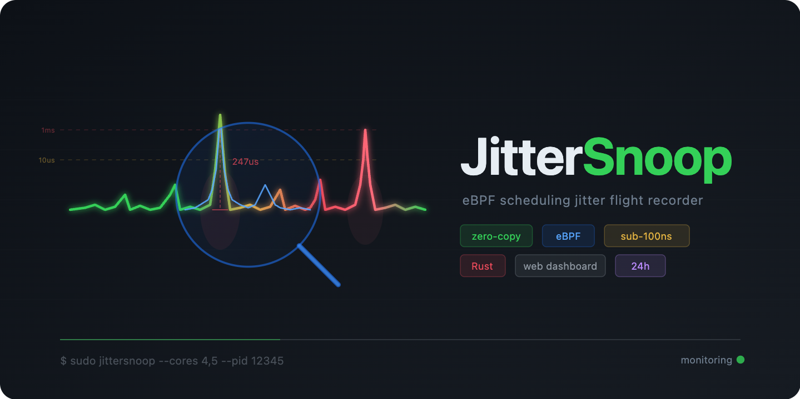
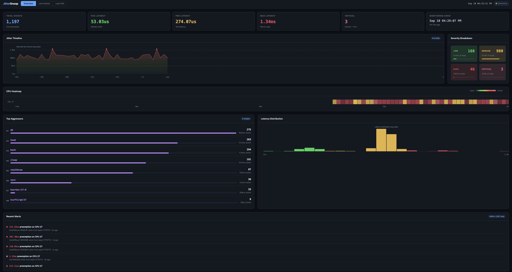
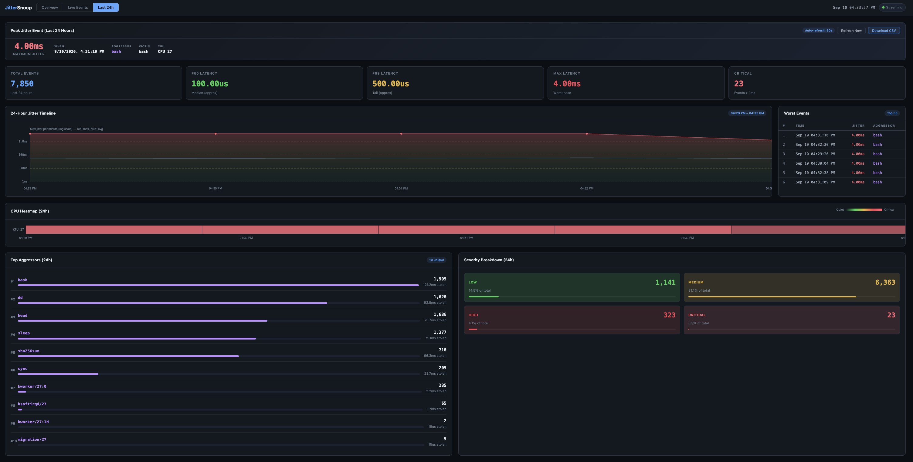

# JitterSnoop


I wanted to build something with eBPF from long time.
This is just a hobby project and experimentation with eBPF.
Feel free to clone and modify as you wish.

JitterSnoop is a zero-overhead scheduling jitter flight recorder for Linux. It uses eBPF to trace when the kernel preempts your latency-critical processes on isolated CPU cores, streaming violations to a real-time web dashboard.

This tool can be used to measure jitters for your high priority engines that you think is only running in a core that you have pinned but silently someone is stealing your cpu.

Built with Rust and [Aya](https://aya-rs.dev).

## The Problem

In low-latency systems — high-frequency trading engines, 5G packet processors, real-time audio pipelines — developers pin critical threads to isolated CPU cores using `isolcpus` and `taskset`. The expectation is that nothing else touches those cores.

But the Linux kernel still injects microsecond-level scheduling jitter:

- **Kernel workqueues** (`kworker`) run maintenance tasks on your isolated core
- **Software interrupts** (`ksoftirqd`) handle network and timer processing
- **RCU callbacks** (`rcu_preempt`) perform read-copy-update garbage collection
- **System daemons** occasionally migrate onto cores they shouldn't

These preemptions last microseconds to milliseconds — invisible to `top` or `htop`, but catastrophic for code that needs sub-10us response times. A single 200us stall in an HFT matching engine can cost hundreds of thousands of dollars in missed trades.

Standard debugging tools can't help:

| Tool | Problem |
|------|---------|
| `perf` | Adds ~5% overhead — unsafe for production |
| `strace` | Adds ~50% overhead — impossible |
| `top` / `htop` | Shows CPU%, not microsecond preemptions |
| `ftrace` | Firehose output, no filtering, no visualization |

## How JitterSnoop Works

JitterSnoop hooks into the kernel's `sched/sched_switch` tracepoint using eBPF — the same mechanism the kernel uses internally. It runs at native kernel speed with effectively zero overhead.

```
                    ┌──────────────────────────┐
                    │     Linux Kernel         │
                    │                          │
                    │  sched/sched_switch      │
                    │     │                    │
                    │     ▼                    │
                    │  ┌──────────────────┐    │
                    │  │ JitterSnoop eBPF │    │
                    │  │                  │    │
                    │  │ 1. Check CPU map │    │
                    │  │ 2. Track switch  │    │
                    │  │ 3. Measure gap   │    │
                    │  │ 4. Emit if > N   │    │
                    │  └────────┬─────────┘    │
                    │           │ RingBuf      │
                    └───────────┼──────────────┘
                                │
                    ┌───────────▼──────────────┐
                    │  JitterSnoop Userspace   │
                    │                          │
                    │  Ring buffer poller      │
                    │  Rolling event buffer    │
                    │  Web dashboard (SSE)     │
                    └──────────────────────────┘
                                │
                        http://localhost:8080
```

When your pinned process leaves the CPU and returns, JitterSnoop measures the gap. If it exceeds a configurable threshold, the event is streamed through an eBPF ring buffer to userspace and broadcast to the web dashboard via Server-Sent Events.

### What Gets Captured

Each jitter event records:

- **Timestamp** — kernel monotonic clock (nanosecond precision)
- **Duration** — how long your process was off the CPU
- **CPU ID** — which core the preemption occurred on
- **Victim** — your pinned process (name + PID)
- **Aggressor** — the process that stole the core (name + PID)

### Severity Classification

| Level | Duration | Meaning |
|-------|----------|---------|
| LOW | < 10us | Normal scheduling noise |
| MED | 10–100us | Noticeable in HFT/telecom workloads |
| HIGH | 100us–1ms | Likely SLA violation |
| CRIT | > 1ms | Critical — your isolated core was stolen |

## Why eBPF

eBPF programs run inside the kernel's scheduler path at native speed. Unlike `perf` or `strace`, JitterSnoop:

- **Adds no measurable overhead** — the eBPF probe executes in ~100ns per context switch
- **Filters in-kernel** — only monitored cores and PIDs trigger any work; everything else is a single hash map lookup and early return
- **Is safe for production** — eBPF programs are verified by the kernel before loading; they cannot crash, loop forever, or access invalid memory
- **Requires no kernel modules** — works on any Linux kernel 5.8+ with BTF support

This makes it suitable as an always-on flight recorder that runs 24/7 in production, capturing events that only happen once an hour or once a day.

The eBPF bytecode is compiled and embedded into the final binary at build time. The output is a single self-contained executable — no external files needed. Helper scripts for demos and core isolation are in `try_out_scripts/`.

## Setup

### Prerequisites

- Linux kernel 5.8+ (check with `uname -r`)
- Root access (eBPF requires `CAP_BPF` + `CAP_TRACING`)

### Install and Build

```bash
git clone <repo-url> jittersnoop
cd jittersnoop
./setup.sh
```

The setup script handles everything automatically:
1. Installs Rust via rustup (if not present)
2. Installs the nightly toolchain (required for BPF target)
3. Adds the `rust-src` component (eBPF target is built from source via `-Z build-std=core`)
4. Builds the eBPF probe and userspace binary

First build takes about 60 seconds. Subsequent builds take about 10 seconds.

### Manual Setup

If you prefer to do it yourself:

```bash
rustup toolchain install nightly
rustup component add rust-src --toolchain nightly
cargo build -p jittersnoop --release
```

The BPF target (`bpfel-unknown-none`) is compiled from source using `-Z build-std=core`, so no prebuilt target is needed.

## Usage

### Quick Demo

```bash
sudo ./target/release/jittersnoop --demo
```

This spawns a victim process and multiple aggressors (heavy I/O, hashing, cache pressure) on the same cores, then opens the web dashboard. Open `http://localhost:8080` in your browser to see jitter events streaming in real time.

### Monitor Specific Cores

```bash
sudo ./target/release/jittersnoop --cores 4,5
```

Reports all scheduling jitter on cores 4 and 5.

### Monitor a Specific Process

```bash
# Start your process and note its PID
taskset -c 4 ./my_trading_engine &
echo $!   # e.g., prints 12345

# Monitor only that process
sudo ./target/release/jittersnoop --cores 4 --pid 12345
```

Now only events where PID 12345 is the victim are reported. All other scheduling noise is filtered out in-kernel.

### Log Events to CSV

```bash
sudo ./target/release/jittersnoop --cores 4 --pid 12345 --log jitter.csv
```

Events are appended to the file as they arrive, with buffered I/O flushed every polling cycle. The CSV columns are:

```
timestamp_ns,duration_ns,cpu_id,victim_pid,aggressor_pid,victim_comm,aggressor_comm
```

Logging happens entirely in userspace — the eBPF probe is unaffected.

### All Options

```
Options:
    --demo                         Run a self-contained demo
    --cores <CORES>                CPU cores to monitor (e.g., "4,5,6")
    --pid <PID>                    Only report jitter against these PIDs
    --threshold-ns <THRESHOLD_NS>  Minimum jitter to report [default: 1000]
    --port <PORT>                  Web dashboard port [default: 8080]
    --log <FILE>                   Append events to a CSV file
```

### Remote Access via SSH

If the machine is remote, forward the dashboard port through your SSH tunnel:

```bash
ssh -L 8080:localhost:8080 user@remote-host
```

Then open `http://localhost:8080` on your local machine.

## Web Dashboard

The dashboard at `http://localhost:8080` has three tabs:

### Overview (default)

The primary view focused on real-time analysis:

- **Live clock** — current time displayed in the header
- **Stat cards** — total events, P50/P99/max latency, critical event count, monitoring start time with uptime
- **Jitter timeline** — time-series chart showing max jitter per second over a 2-minute sliding window (log scale), with severity threshold lines at 10us/100us/1ms and highlighted CRIT spikes
- **Severity breakdown** — four color-coded cards (LOW/MED/HIGH/CRIT) with counts, percentages, and progress bars
- **Top aggressors** — ranked by total stolen CPU time, with bar charts showing relative impact per process
- **Latency distribution** — log-scale histogram color-coded by severity
- **Per-CPU heatmap** — real-time heatmap grid showing jitter intensity per CPU over the sliding window, colored from green (quiet) through yellow/red (noisy)
- **Recent alerts** — only HIGH and CRIT events, with human-readable timestamps



### Live Events

The raw streaming table for individual event detail — color-coded rows with severity, jitter duration, magnitude bar, victim/aggressor names, and timestamps. Auto-scroll with a 500-row cap.

Features a **filter bar** with:
- **Severity toggles** — show/hide events by severity level
- **Text search** — filter by process name
- **CPU filter** — filter by specific CPU ID

### Last 24h

Historical analysis of jitter behavior over the past 24 hours, using per-minute aggregated buckets (max 1440) for bounded memory usage:

- **Peak jitter callout** — worst event with timestamp, aggressor, victim, and CPU
- **Summary stat cards** — total events, approximate P50/P99, max, critical count
- **24h timeline** — per-minute max and average jitter over the full window (log scale)
- **Worst events table** — top 50 events ranked by duration
- **Top aggressors** — aggregated over the 24h window
- **Severity breakdown** — 24h totals by severity level
- **Per-CPU heatmap** — historical heatmap showing which cores were noisiest and when
- **CSV download** — export the full 24h dataset (worst events, per-minute summary, top aggressors) as a CSV file



Auto-refreshes every 30 seconds when the tab is active.

Events stream via Server-Sent Events with no polling. Overview panels refresh at 2Hz.

## Production Deployment

### Isolate Cores First

JitterSnoop is most valuable on isolated cores. Add to `/etc/default/grub`:

```
GRUB_CMDLINE_LINUX="isolcpus=4,5 nohz_full=4,5 rcu_nocbs=4,5"
```

Then `sudo update-grub && reboot`. After reboot:

```bash
# Pin your critical process
taskset -c 4 ./my_app &

# Monitor it
sudo ./target/release/jittersnoop --cores 4,5 --pid $(pgrep my_app) --threshold-ns 5000
```

On a properly isolated core, you should see near-zero events. Any event that appears means something broke through the isolation.

### What to Do with the Results

When JitterSnoop reports an aggressor, the fix depends on what it is:

| Aggressor | Fix |
|-----------|-----|
| `ksoftirqd/N` | Move interrupt affinity off the isolated core: `echo <mask> > /proc/irq/<irq>/smp_affinity` |
| `kworker/N:*` | Check which workqueue is scheduling on the core: use `perf` to trace the workqueue |
| `rcu_preempt` | Ensure `rcu_nocbs=` includes your cores in the boot params |
| `migration/N` | Kernel migration thread — usually harmless, very short |
| Named daemon | Bind it away from isolated cores with `taskset` or cgroup cpusets |

## Technical Details

### eBPF Maps

| Map | Type | Purpose |
|-----|------|---------|
| `MONITORED_CORES` | HashMap | Gate — only fire on these CPUs |
| `MONITORED_PIDS` | HashMap | Gate — only report these victim PIDs |
| `JITTER_THRESHOLD` | PerCpuArray | Runtime-configurable threshold (ns) |
| `START_TS` | PerCpuArray | Tracks when each task left the CPU |
| `VICTIM_PID` | PerCpuArray | Tracks which PID left the CPU |
| `VICTIM_COMM` | PerCpuArray | Tracks the task name that left |
| `EVENTS` | RingBuf (256KB) | Streams violations to userspace |

### Performance Characteristics

- **eBPF probe execution**: ~100ns per `sched_switch` event
- **Non-monitored cores**: single hash map lookup + early return (~50ns)
- **Ring buffer**: lock-free, per-CPU submission, zero-copy read
- **Userspace polling**: 10ms sleep between ring buffer drain cycles
- **Web dashboard**: SSE streaming, no polling, 2Hz overview refresh
- **24h history**: bounded at 1440 per-minute buckets (~negligible memory)

## License

MIT
